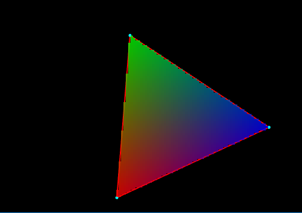

# Taller raster

## Propósito

Comprender algunos aspectos fundamentales del paradigma de rasterización.

## Tareas

Emplee coordenadas baricéntricas para:

1. Rasterizar un triángulo.
2. Sombrear su superficie a partir de los colores de sus vértices.
3. (opcional para grupos menores de dos) Implementar un [algoritmo de anti-aliasing](https://www.scratchapixel.com/lessons/3d-basic-rendering/rasterization-practical-implementation/rasterization-practical-implementation) para sus aristas.

Referencias:

* [The barycentric conspiracy](https://fgiesen.wordpress.com/2013/02/06/the-barycentric-conspirac/)
* [Rasterization stage](https://www.scratchapixel.com/lessons/3d-basic-rendering/rasterization-practical-implementation/rasterization-stage)

Implemente la función ```triangleRaster()``` del sketch adjunto para tal efecto, requiere la librería [nub](https://github.com/nakednous/nub/releases).

## Integrantes

Complete la tabla:

| Integrante | github nick |
|------------|-------------|
| Lizzy Tengana Hurtado | lizzyt10h |
| Laura Morales Ariza | lgmoralesa |
| Sergio Sanchez Plazas | serbatero |

## Discusión

En este taller se implementó la rasterización de un triángulo generado aleatoriamente haciendo uso de la librería Nub a una malla propia. Adicionalemente, cada vértice del triángulo tenía un color asignado y según esto, se coloreó cada pixel (con respecto a la nueva malla) dentro del triángulo de acuerdo a los pesos de cada vertice según su proximidad a cada uno de ellos. Luego se realizó la implementación de la técnica de anti-aliasing con el objetivo de suavizar los colores sobre los bordes del triángulo.

A continuación se muestra la rasterización de un triángulo aleatoreo en diferentes tamaños de malla, donde se puede apreciar un efecto de definición del triángulo a medida que la cantidad de "píxeles" crece.





###Dificultades
Las dificultades que presentamos en un principio se debieron a que no comprendimos con claridad que se debían colorear los "pixeles" sobre la malla generada y no sobre el mundo. Debido a esto tuvimos dificultades para calcular los límites de rasterización.

## Entrega

* Plazo: 4/6/19 a las 24h.
