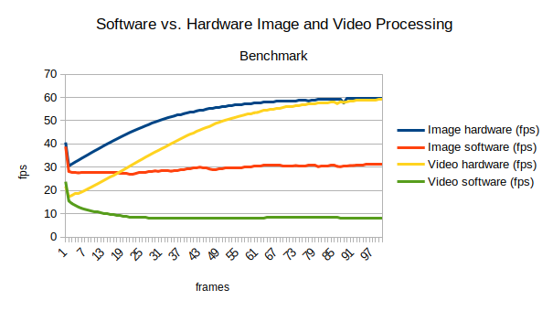
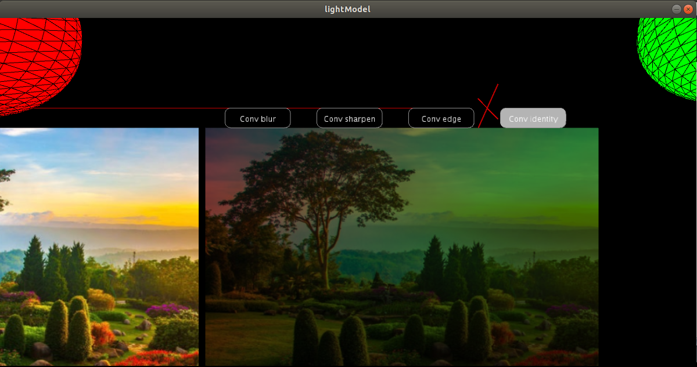
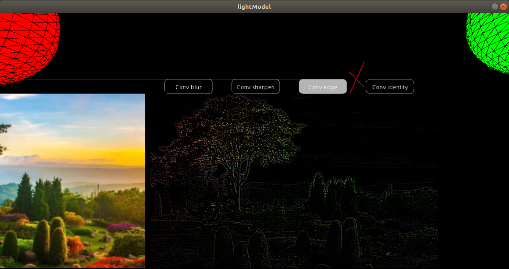
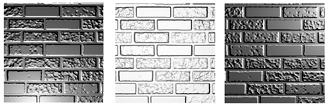

# Taller de shaders

## Propósito

Estudiar los [patrones de diseño de shaders](http://visualcomputing.github.io/Shaders/#/4).

## Tarea

1. Hacer un _benchmark_ entre la implementación por software y la de shaders de varias máscaras de convolución aplicadas a imágenes y video.
2. Implementar un modelo de iluminación que combine luz ambiental con varias fuentes puntuales de luz especular y difusa. Tener presente _factores de atenuación_ para las fuentes de iluminación puntuales.
3. (grupos de dos o más) Implementar el [bump mapping](https://en.wikipedia.org/wiki/Bump_mapping).

## Integrantes

Complete la tabla:

| Integrante | github nick |
|------------|-------------|
| Lizzy Tengana Hurtado | lizzyt10h |
| Laura Morales Ariza | lgmoralesa |
| Sergio Sanchez Plazas | serbatero |

## Informe
### Punto 1 - Image and Video Processing

En este punto se implementaron shaders (hardware) de máscaras de convolución tanto para imágenes como para videos y se los comparó con sus respectivas versiones por software. El resultado fue que las máscaras de convlución implementadas por hardware son significativamente más eficientes computacionalmente que las implementadas por software como se puede ver el la gráfica.

Las implementaciones por hardware tienden a estabilizarce a 60fps que es frameRate por defecto que usa Processing, lo cual indica que el costo computacional de aplicar máscaras de convolución de 3x3 por hardware es casi imperceptible.

Por el contrario, las implementaciones por software ralentizan el desempeño del programa en aprox. 50% en el caso de las imágenes y en aprox. 80% en el caso del video con respecto a la implementación por hardware.

### Punto 2 - Light Model

En este punto se implementó un modelo de luz por medio de shaders (hardware) que consta de luz ambiental, una luz difusa y una luz especular. Las luces especular y difusa se implementaron con la librería nub y se representaron mediante esferas.

Las posiciones y colores de las esferas se le pasan al vertex shader, donde se calcula la intensidad con su respectivo factor de atenuación definido como 1/||dist||, donde dist es la distancia entre la fuente de luz y el vértice en cuestión.

Luego se multiplica el color de cada luz por su intensidad, se suman al color original de la imagen en cada vértice con el fin de obtener el promedio y se asigna el resultado al color del vértice.

Finalmente, las interpolaciones respectivas para aplicar el efecto en los demás puntos de la imágen son manejadas de acuerdo al pipeline de la GPU y se pasan al fragment shader, donde adicionalmente se programaron las máscaras de convolución del punto 1.

### Punto 3 - Bump Mapping

el Bump Mapping da, lo que parece una rugosidad de la superficie sobre un objeto. puede agregar detalles minuciosos a un objeto que, de lo contrario, requeriría una gran cantidad de polígonos, lo cual reduce el rendimiento de la GPU.

El Bump Mapping es una extensión de la técnica de sombreado de Phong. En Phong Shading, la normal de la superficie se interpolaba sobre el polígono, y ese vector se usó para calcular el brillo de ese píxel. Cuando agrega la asignación de relieve, está modificando ligeramente el vector normal, basándose en la información del mapa de relieve. El ajuste del vector normal provoca cambios en el brillo de los píxeles en el polígono.

Mediante el uso de normales por fragmento, podemos engañar a la iluminación para que crea que una superficie consiste en diminutos planos (perpendiculares a los vectores normales) que le dan a la superficie un enorme impulso de detalle. Esta técnica para usar las normales por fragmento en comparación con las normales por superficie se llama bump mapping

- [Phong Shading](https://www.scratchapixel.com/lessons/3d-basic-rendering/phong-shader-BRDF).

## Entrega

Fecha límite ~~Lunes 1/7/19~~ Domingo 7/7/19 a las 24h. Sustentaciones: 10/7/19 y 11/7/19.
